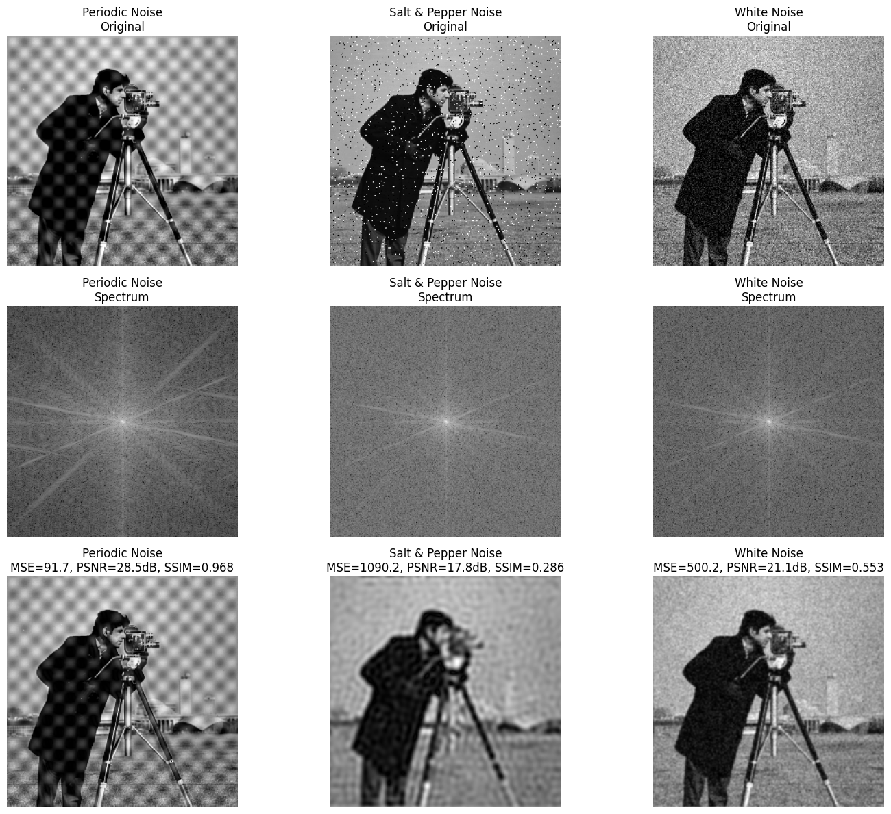
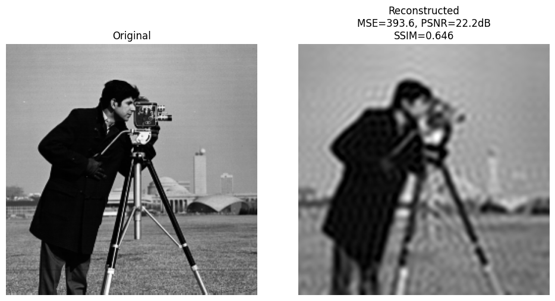

#  Frequency and Filtering Image Processing

This repository contains two main experiments in **image processing** — one focusing on **frequency-domain analysis and filtering**, and the other on **spatial-domain filtering and image cartoonization** using **bilateral filters**.  
All implementations were written in Python using OpenCV and NumPy.

---

##  Part 1: Frequency Domain Image Processing

This section analyzes images in the **frequency domain** using **DFT (Discrete Fourier Transform)** and **DCT (Discrete Cosine Transform)**, applying different frequency filters and evaluating reconstruction quality.

### Implemented Functions
- **DFT & IDFT:** Compute and visualize frequency spectra using `np.fft.fft2`, `np.fft.fftshift`, and inverse DFT.
- **Low-Pass Filters:**  
  - `ideal_lowpass_filter` → hard cutoff of high frequencies.  
  - `gaussian_lowpass_filter` → smooth Gaussian transition.  
- **Butterworth Notch Reject Filter:** Removes specific periodic noise frequencies.
- **DCT Compression:** Keeps low-frequency DCT coefficients to achieve image compression.

### Noise Removal Experiments
Three noisy images were processed:
1. **Periodic Noise**
2. **Salt & Pepper Noise**
3. **White Noise**

For each, the magnitude spectrum was visualized, filtering was applied, and the output was compared using **MSE**, **PSNR**, and **SSIM**.

| Noise Type | MSE | PSNR (dB) | SSIM |
|-------------|-----|------------|-------|
| Periodic Noise | 91.65 | 28.51 | 0.968 |
| Salt & Pepper Noise | 1090.15 | 17.76 | 0.286 |
| White Noise | 500.15 | 21.14 | 0.553 |

### DCT-Based Compression Results
| Metric | Value |
|---------|--------|
| MSE | 393.6 |
| PSNR | 22.2 dB |
| SSIM | 0.646 |

---

##  Part 2: Image Cartoonization

In this section, a **cartoonization pipeline** was built using **bilateral filtering** and **edge detection**.  
The process reduces color gradients and emphasizes strong edges, creating a cartoon-like effect.

###  Steps

#### Step 1: Edge Detection
- Converted image to grayscale.
- Applied Gaussian smoothing.
- Used **Canny edge detection** with dynamic thresholding based on image median.
- Output: an edge mask (`img_edge`) highlighting contours.

#### Step 2: Bilateral Filter
- Implemented **from scratch** using NumPy — without OpenCV’s built-in function.  
- For each pixel, combined:
  - **Spatial Gaussian kernel** (based on distance).
  - **Color Gaussian kernel** (based on intensity difference).  
- Produces a **smoothed but edge-preserving** result (`img_bf`).

> Tested with different parameters:
> - `d = 9–11`
> - `sigma_space = 50`
> - `sigma_color = 50`

#### Step 3: Cartoonization
Combined the blurred image and edges:
- Adjusted the **cartoon intensity** with parameter `α ∈ [0, 1]`.
- When `α = 0`: image remains natural.  
- When `α = 1`: strong cartoon effect with enhanced edges.

| α Value | Description |
|----------|--------------|
| 0.0 | Original image |
| 0.25 | Light smoothing and edges |
| 0.5 | Balanced cartoon effect |
| 1.0 | Maximum stylization |

